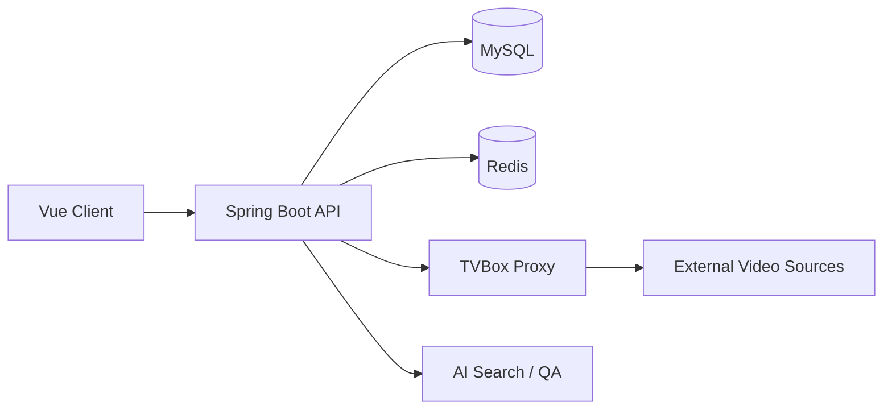

<div align="center">

# Jelly Cinema

一个基于 Spring Boot + Vue 的影视搜索项目。

支持标准搜索、AI 搜片、播放入口聚合、TVBox 回源同步，以及围绕搜索场景做的一些基础工程化处理，比如参数校验、缓存、异步预同步和异常降级。

<p>
  <a href="https://github.com/ZSPSTRIVE/Film-v1/stargazers">
    
  </a>
  <a href="https://github.com/ZSPSTRIVE/Film-v1/network/members">
    
  </a>
  <a href="https://github.com/ZSPSTRIVE/Film-v1/issues">
    
  </a>
</p>

<p>
  
  
  
  
  
</p>

<p>
  <a href="#项目简介">项目简介</a> ·
  <a href="#功能概览">功能概览</a> ·
  <a href="#快速开始">快速开始</a> ·
  <a href="#架构设计">架构设计</a> ·
  <a href="#路线图">路线图</a> ·
  <a href="#贡献方式">贡献方式</a>
</p>

</div>

## 项目简介

这个项目最初是围绕“影视搜索体验”做的一个完整练手仓库，目标不是堆很多概念，而是把几条常见链路串起来：

- 用户可以按片名、类型、上映状态做标准搜索
- 也可以直接输入自然语言，比如“找一部最近口碑不错的动画”
- 本地片库数据不足时，可以通过 TVBox 回源补数据
- 搜索结果进入详情页后，还可以继续做 AI 问答和播放入口查看

整个仓库更偏“能跑、能讲、能继续扩展”的方向，适合：

- 想找一个完整一点的 Spring Boot + Vue 项目做参考
- 想看搜索、缓存、回源这些常见后端问题怎么落地
- 想基于现有项目继续做课程设计、作品集或个人版本

## 功能概览

| 模块 | 说明 | 状态 |
| --- | --- | --- |
| 标准搜索 | 关键词、类型、上映状态筛选 | 已完成 |
| AI 搜片 | 自然语言检索 | 已完成 |
| 搜索回源 | 本地无结果时通过 TVBox 回源并入库 | 已完成 |
| 缓存降级 | 关键词同步缓存，Redis 异常时自动降级 | 已完成 |
| 详情页 | 作品信息、演员、评分、评论数 | 已完成 |
| AI 导语 / 问答 | 基于作品信息继续追问 | 已完成 |
| 播放入口 | 平台入口聚合 + TVBox 固定源同步 | 已完成 |
| 用户模块 | 登录、注册、用户信息 | 已完成 |
| 管理端 | 目前是基础壳，后续继续补 | 进行中 |

## 页面说明

### 首页

- 以内容浏览为主，不是后台列表页风格
- 支持热门标签和 AI 搜索入口
- 可以直接从首页进入搜索链路

### 搜索页

- 标准搜索和 AI 搜片两种模式
- 支持类型、状态筛选
- AI 搜片会返回推荐说明和结果列表

### 详情页

- 展示作品基础信息、演员、评论数
- 支持生成 AI 导语
- 支持针对当前作品继续问答
- 支持查看播放入口和同步 TVBox 固定源

## 技术栈

### 前端

- Vue 3
- Vite
- TypeScript
- Pinia
- Vue Router
- Element Plus
- Tailwind CSS

### 后端

- Spring Boot 3
- MyBatis-Plus
- MySQL
- Redis
- Sa-Token
- Spring AI

### 外部服务与集成

- Node.js
- Express
- Axios
- TVBox Proxy

## 仓库结构

```text
Film-v1
├─ jelly-cinema-client    # 用户端
├─ jelly-cinema-server    # Spring Boot 后端
├─ jelly-cinema-admin     # 管理端基础壳
├─ tvbox-proxy            # 外部片源代理与聚合
└─ db_film.sql            # 数据库初始化参考
```

## 快速开始

### 环境要求

- Node.js 18+
- Java 17+
- Maven 3.9+
- MySQL 8+
- Redis 6+

### 1. 克隆项目

```bash
git clone https://github.com/ZSPSTRIVE/Film-v1.git
cd Film-v1
```

### 2. 准备 MySQL 与 Redis

创建数据库：

```sql
CREATE DATABASE jelly_cinema DEFAULT CHARACTER SET utf8mb4;
```

后端默认读取以下环境变量：

```bash
MYSQL_HOST=localhost
MYSQL_PORT=3306
MYSQL_USER=root
MYSQL_PASSWORD=root
REDIS_HOST=localhost
REDIS_PORT=6379
```

### 3. 启动 TVBox 代理

```bash
cd tvbox-proxy
npm install
npm run dev
```

默认地址：`http://127.0.0.1:3001`

### 4. 启动后端

```bash
cd jelly-cinema-server
mvn spring-boot:run
```

默认地址：`http://127.0.0.1:9500`

### 5. 启动前端

```bash
cd jelly-cinema-client
npm install
npm run dev
```

默认地址通常为：`http://127.0.0.1:5173`

## 常用接口

| 接口 | 说明 |
| --- | --- |
| `GET /api/v1/media/search` | 标准搜索 |
| `GET /api/v1/media/ai-search` | AI 搜片 |
| `GET /api/v1/media/{id}` | 作品详情 |
| `GET /api/v1/media/{id}/play-sources` | 获取播放入口 |
| `POST /api/v1/media/{id}/sync-tvbox-sources` | 同步 TVBox 固定源 |
| `POST /api/v1/media/ai-summary` | 生成 AI 导语 |
| `POST /api/v1/media/{id}/ai-question` | 作品问答 |
| `POST /api/v1/user/login` | 登录 |
| `POST /api/v1/user/register` | 注册 |

## 架构设计



### 搜索主链路

标准搜索的大致流程如下：

1. 前端发起搜索请求
2. 后端优先查询本地 MySQL
3. 如果结果为空或不足，则通过 TVBox Proxy 回源
4. 回源结果写回本地库，供后续搜索复用
5. 对相同关键词做 Redis 缓存，减少重复同步
6. Redis 异常时自动降级，不影响搜索主流程

这个实现没有刻意做得很复杂，主要考虑的是：

- 本地查询响应稳定
- 冷启动时不至于完全搜不到
- 回源结果能沉淀到本地
- 缓存异常不会把主流程一起拖垮

## 项目特点

这个项目比较适合当作一个“能继续长出来”的基础仓库，原因主要有几点：

- 不是单纯的后台管理模板，也不是只调用模型接口的 Demo
- 前端和后端都有实际可展示的内容
- 搜索、缓存、回源、异常处理这些链路比较完整
- 代码复杂度还算可控，适合继续二次开发

## 路线图

- [x] 标准搜索
- [x] AI 搜片
- [x] TVBox 回源同步
- [x] Redis 关键词缓存
- [x] 播放入口聚合
- [x] 详情页 AI 导语与问答
- [x] 参数校验与基础单测
- [ ] Docker Compose 一键启动
- [ ] 管理端完善
- [ ] 截图与演示视频补充
- [ ] 部署文档整理

## 贡献方式

欢迎提交 Issue 或 PR，比较适合贡献的方向包括：

- 完善部署文档和 Docker 化支持
- 补充管理端页面
- 优化 UI 和移动端体验
- 增加测试覆盖率
- 改进搜索排序和推荐效果
- 增加更多数据源或同步策略

如果准备提 PR，建议先提一个 Issue 说明目标，方便对齐方向。

## 参考

README 的组织方式参考了几类成熟开源项目常见结构，比如：

- [vue-vben-admin](https://github.com/vbenjs/vue-vben-admin)
- [mall](https://github.com/macrozheng/mall)
- [Halo](https://github.com/halo-dev/halo)

主要参考的是它们在首页信息组织上的做法，不是照搬内容。

## Star History

[](https://www.star-history.com/#ZSPSTRIVE/Film-v1&Date)

## 如果这个项目对你有帮助

欢迎点个 Star，或者直接 Fork 做你自己的版本。  
如果你正在做课程设计、作品集或练手项目，也欢迎拿它继续改。
